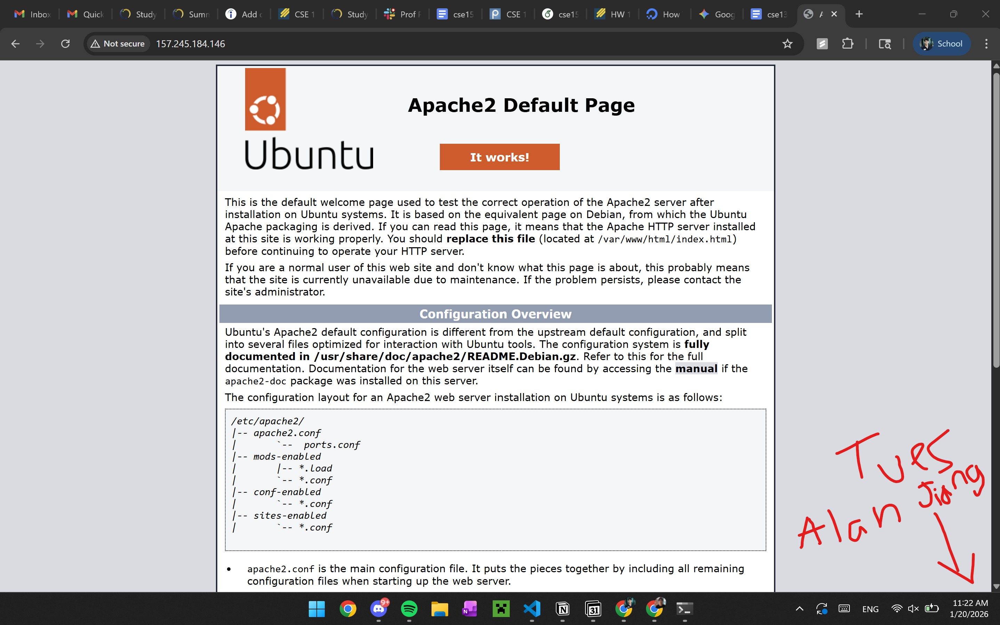
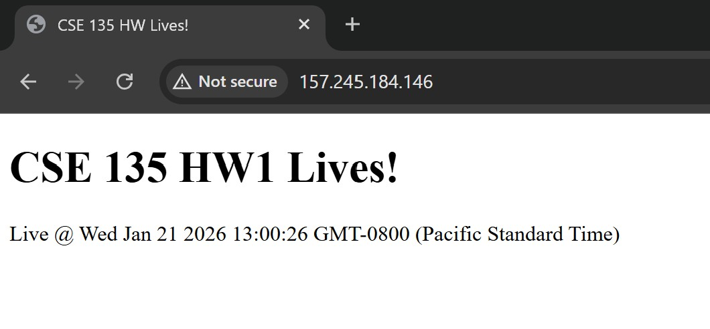
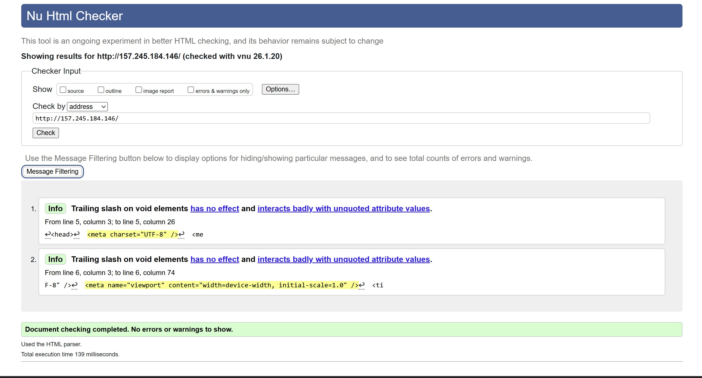
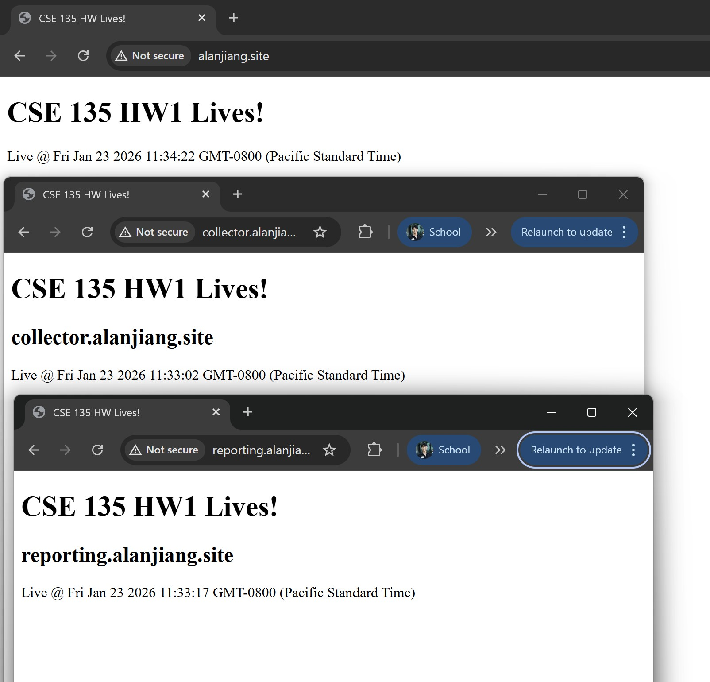
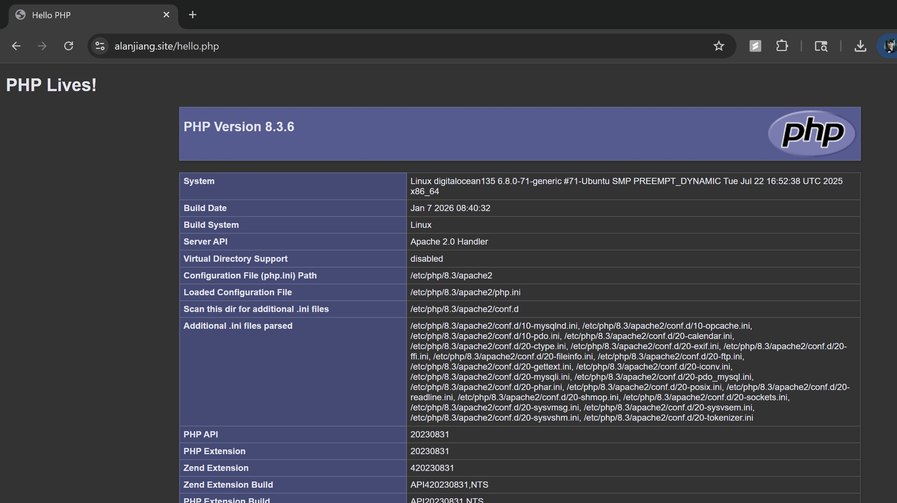
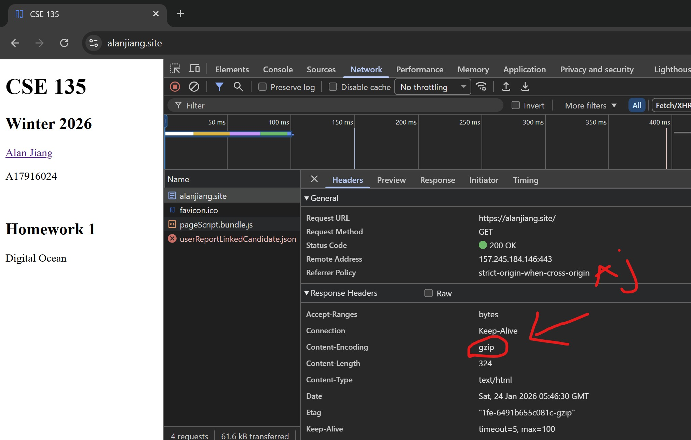
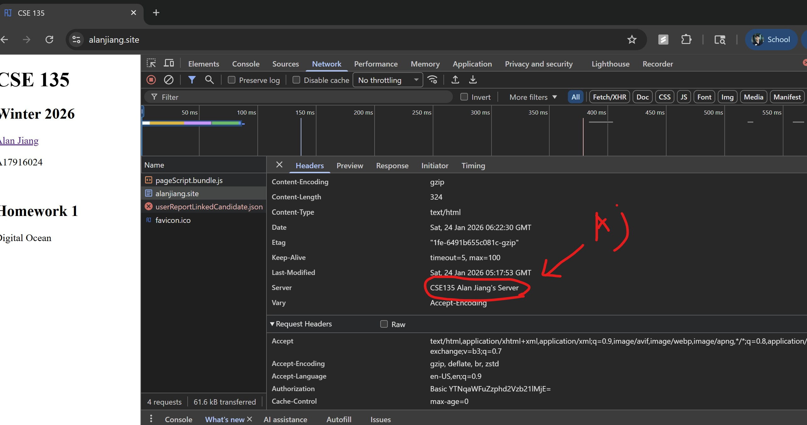
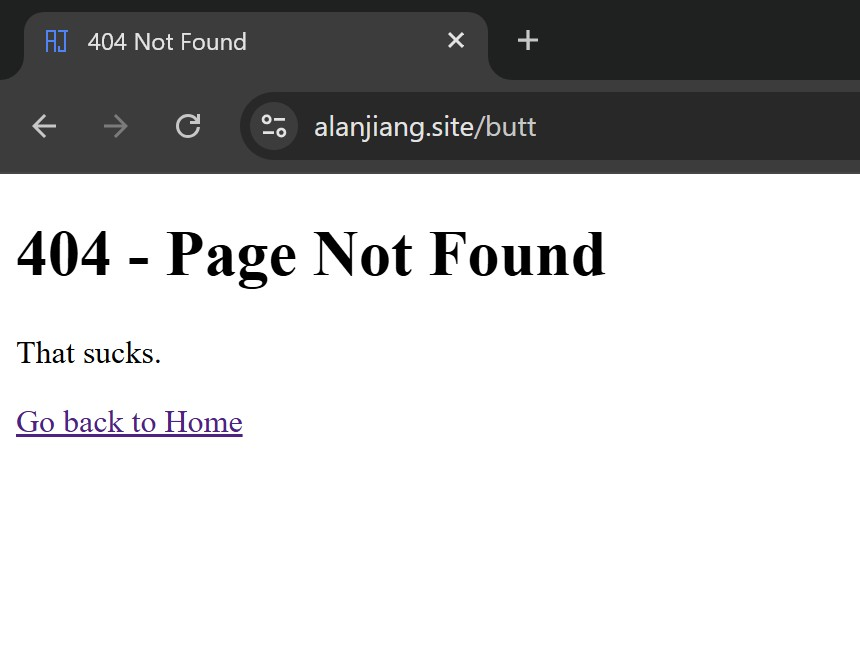
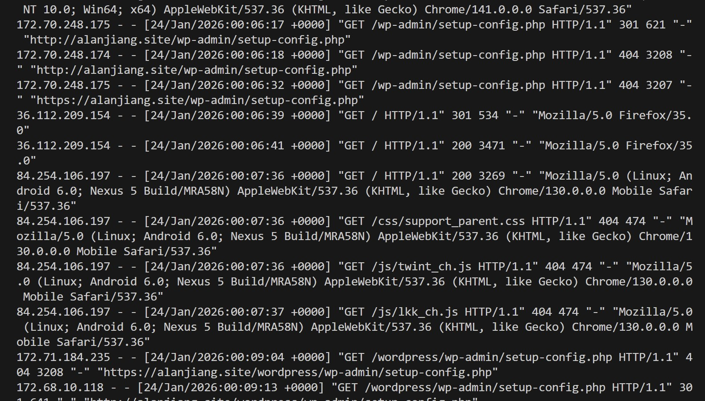
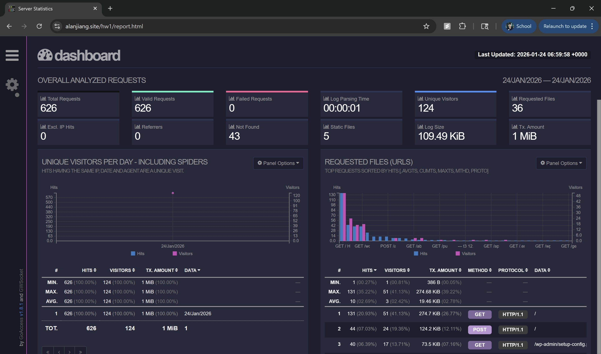

Alan Jiang
I worked on this HW1 by myself.
I plan to be on a team with Aman Ambastha in the future.

Grader pass: 135grader
Grader private key: b3BlbnNzaC1rZXktdjEAAAAABG5vbmUAAAAEbm9uZQAAAAAAAAABAAAAMwAAAAtzc2gtZWQyNTUxOQAAACCVaaCNF0dEct7qYfv3DGL6ESWlFyolxNpkCZMs7FNJdwAAAKD9/h/A/f4f
wAAAAAtzc2gtZWQyNTUxOQAAACCVaaCNF0dEct7qYfv3DGL6ESWlFyolxNpkCZMs7FNJdw
AAAEBzHMl3P3kY/10HIiIP4sQ3BcVlRE2fg0WagAFr2TD005VpoI0XR0Ry3uph+/cMYvoR
JaUXKiXE2mQJkyzsU0l3AAAAF2ppYW5nYWxhbkBBSlplbmJvb2sxNFgyAQIDBAUG
No passphrase

URL
alanjiang.site

Auto-Deploy
I decided to configure my deploy with GitHub Actions because it is relatively simple to setup as it is directly on GitHub.
First, I needed to setup an SSH key for my server to be able to commit changes to the repo.
Next, I set up a key for the repo to do things on my server.
Then, I set up secret variables about the server's details like IP address and details about my user.
Finally, I created a .yaml file that defines the workflow procedures which SSH into the server with my user details and then runs a script to restart apache so the changes can be seen on the site.

Site USER/PASS details:
a3jiang: awesome21
grader: 135grader

Compression Details
After configuring mod-deflate, the compression works correctly as I can see there is a header called content-encoding which the value for it is gzip which is what we wanted. Ironically, the transferred data size is larger at 0.7 kB than the resource size of 0.5 kB. My guess is that compression at this file size is somewhat uncessary.

Server Header Details
I was able to change the Server header because I noticed that I would get this note everytime I ran configtest which yelled at me for something related to the ServerName and it gave me a hint as to what I was looking for. Then looking in some conf files I found a ServerSignature line. Then I promptly asked an LLM what I should do.

